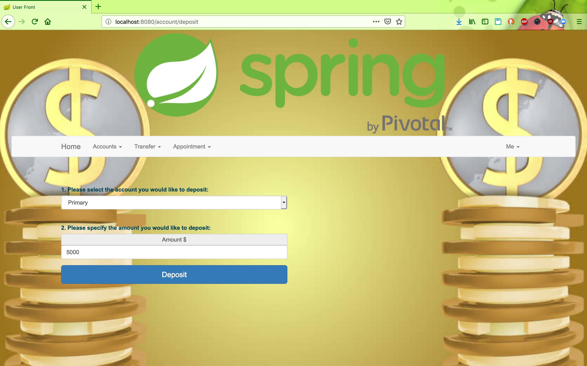

# Online-Bank-Simulator

Spring Boot/Spring Data/Spring Security/Hibernate/MySQL/REST

The project simulates online banking system. It allows to register/login, deposit/withdraw money from accounts, add/edit recipients, transfer money between accounts and recipients, view transactions, make appointments.

There are two roles user and admin.

## Screen shot 

### Sign Up Page

### Sign In Page

### Dashboard Page

### Deposit Page

### Dashboard Page   

## Spring Boot/Spring Data/Spring Security/Hibernate/MySQL/REST

