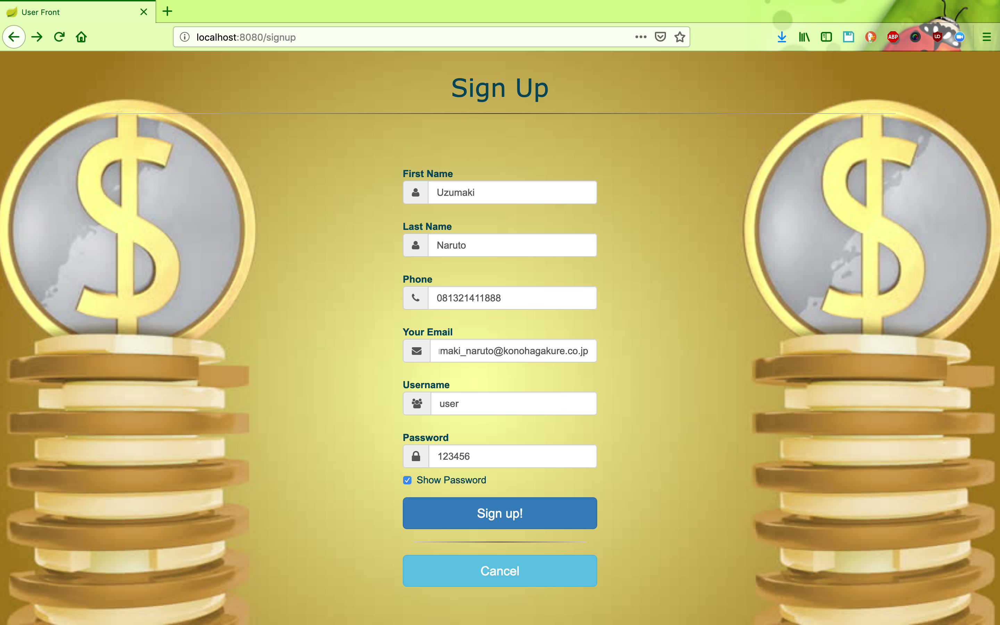
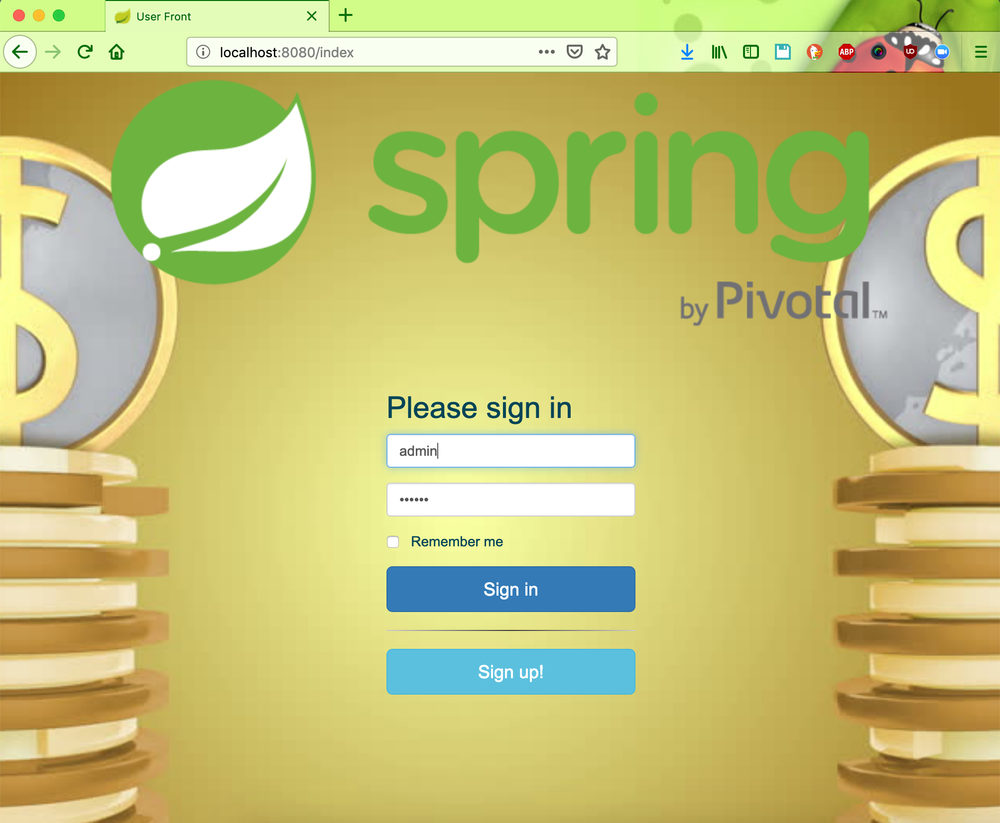

# Online Banking System

This project is a full-stack online banking system developed using AngularJS for the frontend and Spring Boot for the backend. It leverages technologies such as Spring Data, Spring Security, Hibernate, and MySQL to provide a comprehensive banking experience.

## Features

- **User Authentication**: Secure registration and login for users.
- **Account Management**: Deposit and withdraw funds from accounts.
- **Recipient Management**: Add and edit recipients for fund transfers.
- **Fund Transfers**: Transfer money between accounts and to registered recipients.
- **Transaction History**: View detailed records of all transactions.
- **Appointments**: Schedule appointments with bank representatives.

The system supports two roles: **User** and **Admin**.

## Screenshots

### Sign-Up Page


### Sign-In Page


### Dashboard


### Deposit Page


## Technologies Used

- **Frontend**: AngularJS
- **Backend**: Spring Boot, Spring Data, Spring Security
- **Database**: MySQL
- **ORM**: Hibernate
- **RESTful APIs**: Implemented for client-server communication

## Setup Instructions

### Clone the Repository

```bash
git clone https://github.com/ThePunisher30/Online-Banking-System.git
```

### Backend Setup

1. Navigate to the `src` directory.
2. Configure the `application.properties` file with your MySQL database credentials.
3. Build and run the Spring Boot application.

### Frontend Setup

1. Navigate to the frontend directory (if separate).
2. Install the required npm packages:

   ```bash
   npm install
   ```

3. Run the AngularJS application:

   ```bash
   ng serve
   ```

## Docker Support

The project includes Docker support with the following files:

- **Dockerfile**: For building the application image.
- **Dockerfile-Jenkins-Maven**: For Jenkins integration with Maven.
- **Jenkinsfile**: Defines the Jenkins pipeline for CI/CD.

## Contributing

Contributions are welcome! Please fork the repository and submit a pull request for any enhancements or bug fixes.

## License

This project is licensed under the MIT License.

---

*Note: This README is based on the information available from the repository and may require further details for complete setup and usage instructions.*
